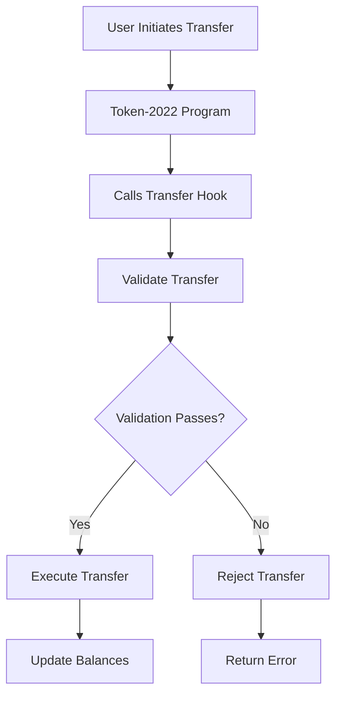

# 🚀 Token-2022 AMM DEX

A cutting-edge Automated Market Maker (AMM) built specifically for Solana's **Token-2022** standard with **Transfer Hook** support. The first DEX to enable compliant and programmable token trading on Solana.


## 🌟 Overview

This project solves a critical gap in the Solana ecosystem: **no major AMMs currently support Token-2022 with Transfer Hooks**. Our solution enables trading of:

- 🏛️ **Real-World Assets (RWA)** with compliance requirements
- 🏢 **Enterprise tokens** with built-in KYC/AML
- ⚙️ **Programmable tokens** with custom business logic
- 📋 **Regulated financial instruments** requiring approvals

## ✨ Key Features

### 🔧 Core Technology
- **Token-2022 Native Support** - Full compatibility with Solana's advanced token standard
- **Transfer Hook Integration** - Custom logic execution during token transfers
- **Advanced AMM Logic** - Constant product formula (x*y=k) with safe math operations
- **Cross-Program Invocation** - Seamless interaction between programs

### 🎨 Modern UI/UX
- **Beautiful Interface** - Modern, responsive design with smooth animations
- **Real-time Trading** - Instant swap execution with live price updates
- **Portfolio Tracking** - Comprehensive asset management and analytics
- **Mobile Responsive** - Works perfectly on all devices

### 🛡️ Security & Compliance
- **Transfer Hook Validation** - Automatic compliance checking during trades
- **Safe Math Operations** - Overflow protection and error handling
- **Audit-Ready Code** - Clean, well-documented smart contracts

## 🏗️ Architecture

### Smart Contracts

#### 1. Transfer Hook Program
- **Program ID**: `o1ZEvtrSXokknjnyaMkp7xyXfMJr4znptdpba7XKoiT`
- **Purpose**: Executes custom logic during token transfers
- **Key Functions**:
  - `initialize_extra_account_meta_list` - Sets up required accounts
  - `transfer_hook` - Validates and processes transfers
  - `fallback` - Handles interface compatibility

#### 2. AMM Program
- **Program ID**: `6vL4UPFu43VpdcD8jBs8F4AvtaMtDxkEWMNpZJZtueYM`
- **Purpose**: Manages liquidity pools and token swaps with transfer hook support
- **Key Functions**:
  - `initialize_amm` - Creates AMM state with Token-2022 vaults
  - `create_pool` - Establishes new trading pairs with liquidity transfers
  - `swap` - Executes token exchanges with hook enforcement
  - `initialize_whitelist` - Creates whitelist for allowed hook programs
  - `add_hook_program` - Adds transfer hook program to whitelist
  - `remove_hook_program` - Removes transfer hook program from whitelist

### Frontend Application
- **Framework**: Next.js 15 with TypeScript
- **Styling**: Tailwind CSS with custom components
- **Animations**: Framer Motion for smooth interactions
- **Wallet**: Phantom wallet integration
- **State Management**: React hooks with real-time updates

## 🚀 Getting Started

### Prerequisites

- **Node.js** 18+ and npm/yarn
- **Rust** 1.70+ and Cargo
- **Solana CLI** 1.16+
- **Anchor Framework** 0.29+
- **Phantom Wallet** (for testing)

### Installation

1. **Clone the repository**
   ```bash
   git clone <repository-url>
   cd sideproject
   ```

2. **Install dependencies**
   ```bash
   # Frontend dependencies
   cd ui
   npm install

   # Anchor dependencies (if building programs)
   cd ../token-2022-amm
   yarn install
   ```

3. **Environment Setup**
   ```bash
   # Set Solana to devnet
   solana config set --url devnet

   # Create a new keypair (if needed)
   solana-keygen new
   ```

### Running the Application

1. **Start the frontend**
   ```bash
   cd ui
   npm run dev
   ```

2. **Access the application**
   - Open [http://localhost:3001](http://localhost:3001)
   - Connect your Phantom wallet
   - Switch to Solana Devnet

## 🎯 Usage Guide

### 1. Create Token-2022 with Transfer Hooks

1. Navigate to the **Create Token** tab
2. Fill in token details:
   - **Name**: Your token name
   - **Symbol**: Token symbol (3-10 characters)
   - **Decimals**: Precision (0-9, typically 9)
   - **Supply**: Initial token supply
3. Click **Create Token** and confirm transaction
4. Initialize transfer hook account when prompted

### 2. Create Liquidity Pool

1. Go to **Create Pool** tab
2. Select your tokens:
   - **Token A**: First token in the pair
   - **Token B**: Second token in the pair
3. Set initial liquidity amounts
4. Click **Create Pool** and confirm

### 3. Trade Tokens

1. Open the **Trade** tab
2. Configure your swap:
   - **From**: Token to sell
   - **To**: Token to buy
   - **Amount**: Quantity to swap
3. Review pricing and slippage
4. Click **Swap Tokens** and confirm

#### Transfer Hook Integration & Whitelist System

Our AMM enforces transfer hooks during swaps through a comprehensive whitelist and remaining accounts system:

**Architecture:**
- **Whitelist PDA**: Each AMM maintains a whitelist of approved transfer hook programs
- **Hook Enforcement**: During swaps, the AMM checks if the mint's hook program is whitelisted
- **Remaining Accounts**: ExtraAccountMetaList PDAs are passed as remaining accounts for hook execution

**Implementation Flow:**
1. AMM extracts transfer hook program ID from Token-2022 mint extensions
2. Validates the hook program is in the AMM's whitelist (`HookNotWhitelisted` error if not)
3. Constructs manual `spl_token_2022::instruction::transfer_checked` with remaining accounts
4. Token-2022 program resolves ExtraAccountMetaList and invokes the hook program
5. Hook program executes custom logic (e.g., rejects odd amounts in our demo)

**One-Click Setup in UI:**
- **Init Whitelist**: Creates whitelist PDA for current token pair
- **Add Hook To Whitelist**: Adds transfer hook program to allowed list
- **Init EAML**: Initializes ExtraAccountMetaList for both mints
- **Test Scenarios**: Generate on-chain proof transactions (allowed/rejected/not-whitelisted)

**Explorer Proof Transactions:**
Use the scenario buttons in the Trade tab to generate real devnet transactions:
- Allowed swap (whitelisted + even amount): *[Generate via UI]*
- Rejected by hook (whitelisted but odd amount): *[Generate via UI]*
- Not whitelisted (hook program removed): *[Generate via UI]*

### 4. Monitor Portfolio

1. Visit the **Portfolio** tab
2. View your assets:
   - Token balances and USD values
   - LP positions and earnings
   - Recent transaction history
3. Track performance with real-time updates

## 🔧 Technical Implementation

### Transfer Hook Flow



### AMM Swap Logic

```rust
// Constant product formula: x * y = k
let k = reserve_a * reserve_b;
let new_reserve_a = reserve_a + amount_in;
let new_reserve_b = k / new_reserve_a;
let amount_out = reserve_b - new_reserve_b;
```

### Key Data Structures

```rust
#[account]
pub struct Pool {
    pub token_a_mint: Pubkey,
    pub token_b_mint: Pubkey,
    pub token_a_reserve: u64,
    pub token_b_reserve: u64,
    pub lp_mint: Pubkey,
}

#[account]
pub struct Amm {
    pub authority: Pubkey,
    pub fee_rate: u16, // basis points
}
```

## 🧪 Testing

### Running Tests

```bash
# Anchor program tests
cd token-2022-amm
anchor test

# Frontend tests (if implemented)
cd ui
npm test
```

### Test Coverage

- ✅ Token creation and minting
- ✅ Transfer hook initialization
- ✅ AMM pool creation
- ✅ Token swaps with hooks
- ✅ Error handling and edge cases

## 📁 Project Structure

```
sideproject/
├── ui/                          # Next.js frontend
│   ├── app/
│   │   ├── page.tsx            # Main DEX interface
│   │   ├── docs/               # Documentation pages
│   │   └── globals.css         # Global styles
│   └── package.json
├── token-2022-amm/             # Anchor workspace
│   ├── programs/
│   │   ├── token-2022-amm/     # AMM program
│   │   └── token-hook/         # Transfer hook program
│   ├── tests/                  # Program tests
│   └── Anchor.toml
├── improved-amm-program.rs     # Enhanced AMM with safe math
├── complete-transfer-hook.rs   # Full transfer hook implementation
└── README.md                   # This file
```

## 🎨 UI Features

### Modern Design Elements
- **Glassmorphism effects** with backdrop blur
- **Gradient animations** and smooth transitions
- **Floating background logos** (Solana, Phantom, DeFi)
- **Interactive hover states** and micro-animations
- **Professional color scheme** with orange-purple gradients

### Responsive Components
- **Tab navigation** with animated indicators
- **Card-based layouts** for better organization
- **Real-time data updates** with loading states
- **Mobile-optimized** touch interactions

## 🚨 Important Notes

### Deployment Status
- **Transfer Hook Program**: `o1ZEvtrSXokknjnyaMkp7xyXfMJr4znptdpba7XKoiT` (deployed to devnet)
- **AMM Program**: `6vL4UPFu43VpdcD8jBs8F4AvtaMtDxkEWMNpZJZtueYM` (deployed with vaults, whitelist, hook enforcement)
- **Frontend**: Production-ready with comprehensive UI and one-click setup tools

### Known Limitations
- Currently supports **devnet only**
- **Mock pricing data** for portfolio values
- **Basic slippage protection** (adjustable)

### Security Considerations
- All programs use **safe math operations**
- **Input validation** on all user inputs
- **Error handling** for edge cases
- **Audit recommended** before mainnet deployment

## 🛣️ Roadmap

### Phase 1: Core Features ✅
- [x] Token-2022 creation with transfer hooks
- [x] Transfer hook program with ExtraAccountMetaList initialization
- [x] AMM with Token-2022 vaults and whitelist system
- [x] Hook enforcement during swaps with remaining accounts
- [x] One-click setup tools for whitelist and EAML initialization
- [x] Scenario generation for on-chain proof transactions
- [x] Modern UI with real wallet integration and portfolio tracking

### Phase 2: Enhanced Features 🚧
- [ ] Advanced pool analytics
- [ ] Liquidity provider rewards
- [ ] Multi-hop swaps
- [ ] Price oracles integration

### Phase 3: Enterprise Features 🔮
- [ ] Governance token and DAO
- [ ] Cross-chain bridges
- [ ] Institutional trading features
- [ ] Compliance reporting tools

## 🤝 Contributing

We welcome contributions! Please:

1. Fork the repository
2. Create a feature branch
3. Make your changes
4. Add tests if applicable
5. Submit a pull request

### Development Guidelines
- Follow Rust and TypeScript best practices
- Add comprehensive comments
- Include tests for new features
- Update documentation

## 📄 License

This project is licensed under the MIT License. See LICENSE file for details.

## 🆘 Support

### Getting Help
- **Documentation**: Check the `/docs` page in the app
- **Issues**: Open a GitHub issue
- **Discord**: Join our community (link coming soon)

### Common Issues
1. **"Program not found"** - Ensure you're on Solana devnet
2. **"Insufficient SOL"** - Request devnet SOL from faucet
3. **"Transaction failed"** - Check wallet connection and try again

## 🏆 Achievements

- ✨ **First AMM** to support Token-2022 with Transfer Hooks
- 🚀 **Modern UI/UX** with professional design
- 🛡️ **Security-focused** with safe math operations
- 📱 **Mobile-responsive** for all devices
- ⚡ **High performance** with optimized code

---

**Built with ❤️ for the Solana ecosystem**

*Enabling the future of compliant and programmable DeFi*
